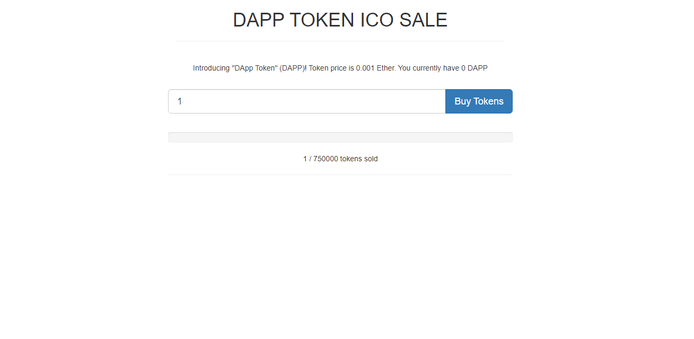

# ERC-20 Token

Smart contract project built in the Rinkeby Test Network for Ethereum. The contract consist on building a token with the ERC-20 implementation for building fungible tokens on the ethereum virtual machine and a smart contract for the token sale.

## Built With

- Solidity 0.4.17
- Javascript
- React
- ReactDOM
- Web3 1.0.0-beta.26
- Ganache
- truffle-hdwallet-provider
- Rinkeby Test Network
- Metamask Wallet
- go-ethereum
- lite-server

## Author

- 👤GitHub: [Jose Abel Ramirez](https://github.com/jose-Abel)
- Linkedin: [Jose Abel Ramirez Frontany](https://www.linkedin.com/in/jose-abel-ramirez-frontany-7674a842/)

## Getting Started

To download the project either can do it with with git clone command:

git clone https://github.com/jose-Abel/ERC-20-Token.git

Or can download it as a zip file and extracting it in your machine

To interact with the live version can get the Metamask wallet and change the settings for the Rinkeby network, once having Eth in the Rinkeby network can test the purchase of the token.

## Live version

https://jose-abel-dapp-token.netlify.app/

## Setup

After getting the files, in the root directory type the commands:

npm run dev

## Tests

The test where created with truffle library, so in order to run it need to have the local Ganache network running by downloading and installing Ganache.

After downloading and installing Ganache, run the tests by typing the command:

truffle test

## 📝 License

This project is MIT licensed.

## Show your support

Give a ⭐️ if you like this project!
